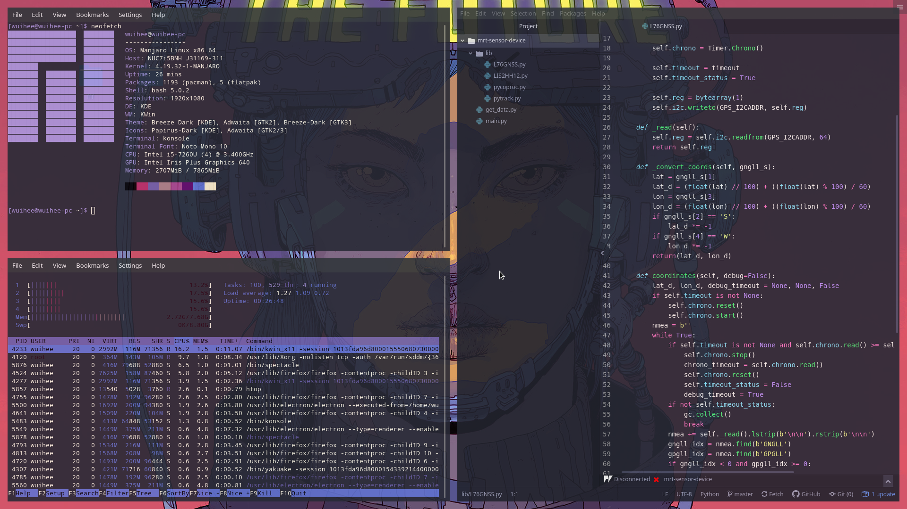
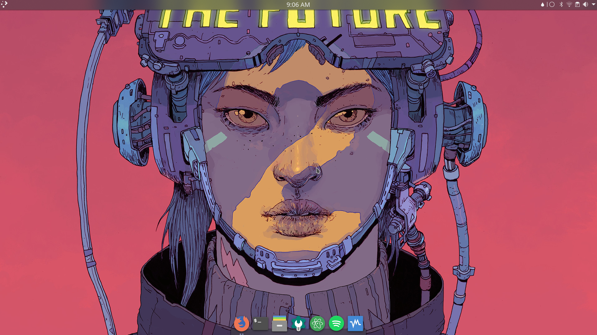
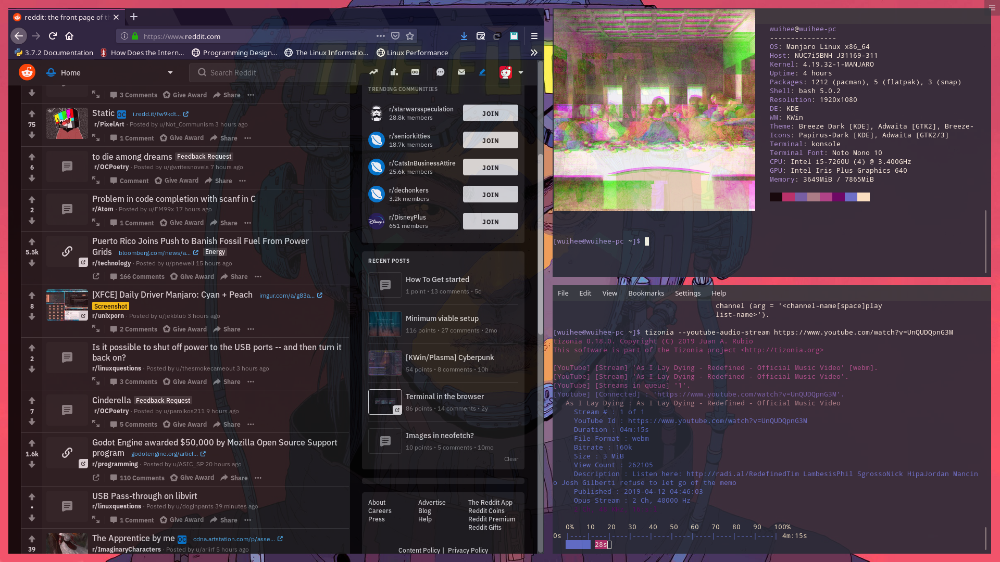
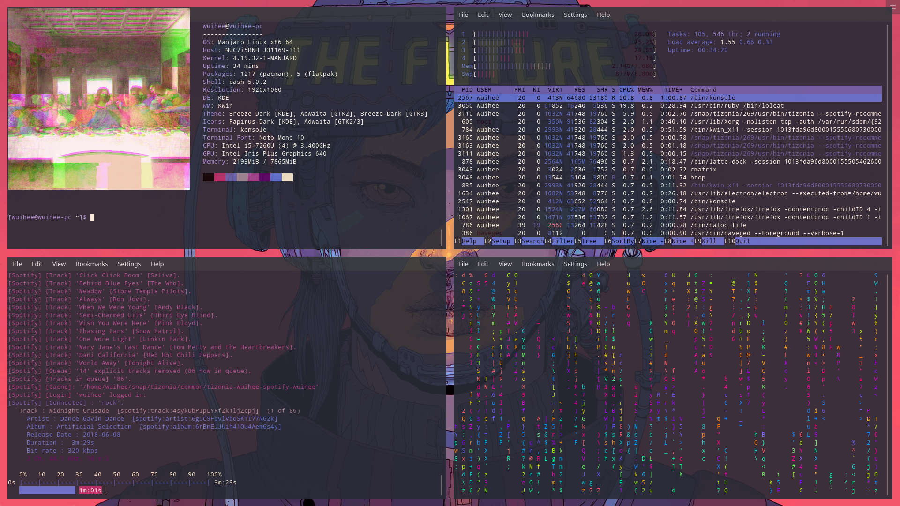

# cyberpunk-rice
KWin/KDE Rice

## Desktop
1. Color Scheme: ~/.local/share/color-schemes
2. Edit gtk (in location): /usr/share/themes/Breeze-Dark
3. Edit breeze-dark theme (in location): /usr/share/plasma/desktoptheme/breeze-dark
4. Install papirus icons: https://github.com/PapirusDevelopmentTeam/papirus-icon-theme
5. Latte Dock: https://github.com/KDE/latte-dock
6. Tiling: https://github.com/lingtjien/Grid-Tiling-Kwin

## Applications
1. Atom Color Scheme: Dracula
2. Terminal Color Scheme Petals (in location): ~/.local/share/konsole
3. Firefox Color Scheme: purple_lantern.zip

## Command Line Apps
1. htop: https://github.com/tizonia/tizonia-openmax-il#snap-package
2. neofetch: https://github.com/dylanaraps/neofetch
3. lolcat: https://github.com/dylanaraps/neofetch
4. cmatrix: https://github.com/abishekvashok/cmatrix
5. tizonia: https://github.com/tizonia/tizonia-openmax-il#snap-package
6. fff: https://github.com/abishekvashok/cmatrix

## Screenshots

